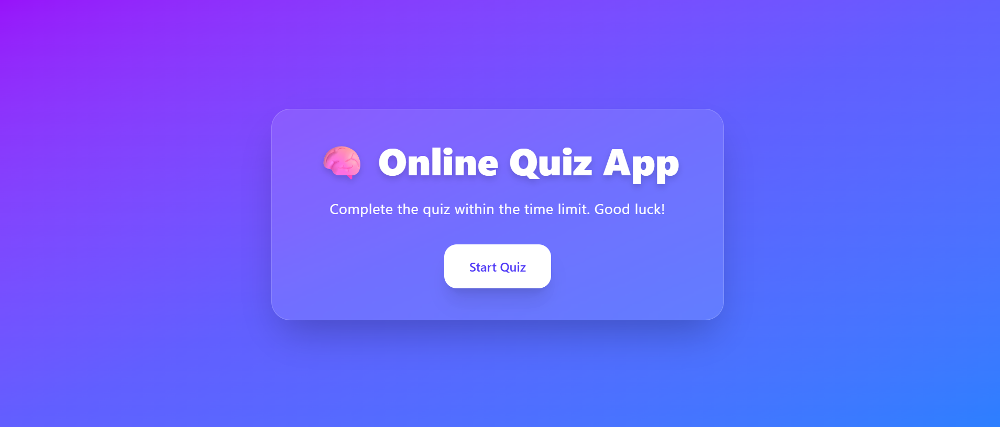
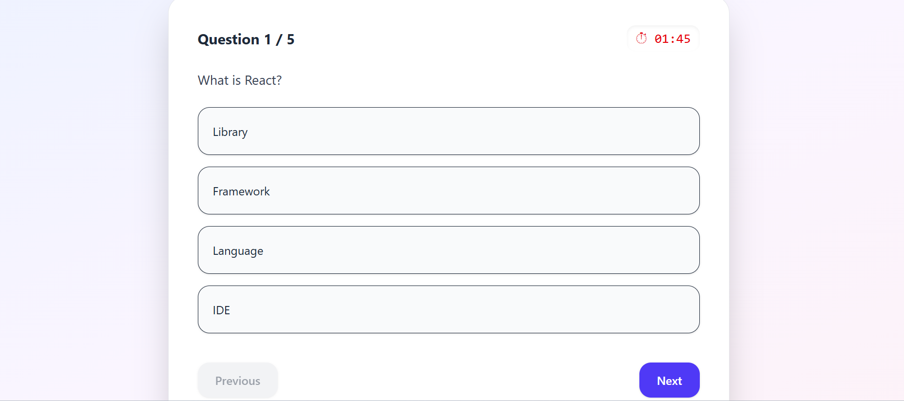
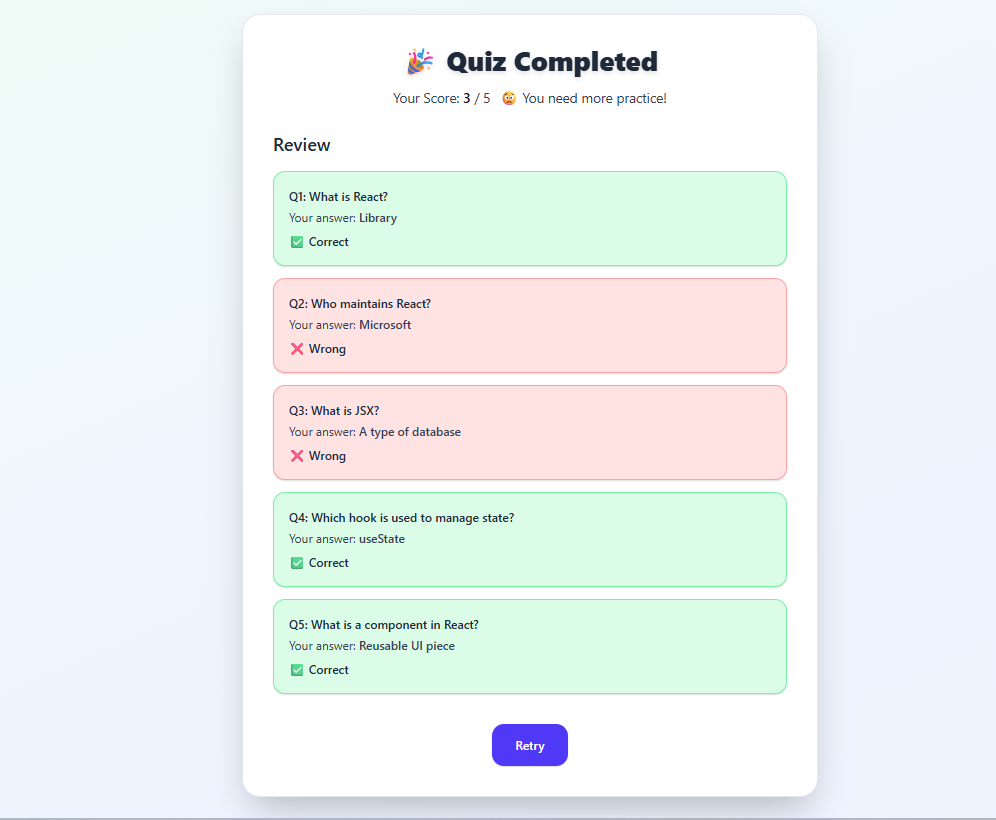

# 🧠 Full-Stack Quiz Application

A full-stack web application where users can take a quiz, navigate through questions, submit answers, and view their final score — all in a seamless and interactive interface.

---

## 🚀 Project Overview

This project is a complete **end-to-end quiz platform** built using a modern web stack.
Users can:

- Start a quiz from the landing page
- Answer one question at a time with navigation support
- Submit the quiz and see their score instantly
- (Bonus) See which questions they got right or wrong
- ⏱️ If the **timer runs out**, the quiz is **auto-submitted** and the result is displayed immediately

---

## 🌐 Live Demo

🔗 **Deployed URL:** [Add your deployed link here] <!-- TODO: Add deployed URL after deployment -->

---

## 📸 Screenshots

### 🏁 Start Page

> Users can begin the quiz with a single click.

 <!-- Replace with actual image -->

---

### 🧩 Quiz Page

> Displays one question at a time, with navigation, timer, and options.

 <!-- Replace with actual image -->

---

### 📊 Results Page

> Shows the user's final score and detailed result breakdown.

 <!-- Replace with actual image -->

---

## 🛠️ Tech Stack

**Frontend:**

- React.js
- Typescript
- Tailwind CSS
- Axios (for API calls)

**Backend:**

- Node.js
- Express.js
- PostgreSQL

---

---

## ⚙️ Installation & Setup

### 1. Clone the Repository

```bash
git clone https://github.com/sharadParadhi/Quizz-App.git
cd quiz-app
```
